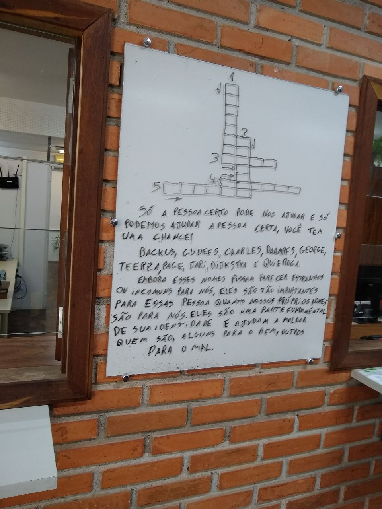
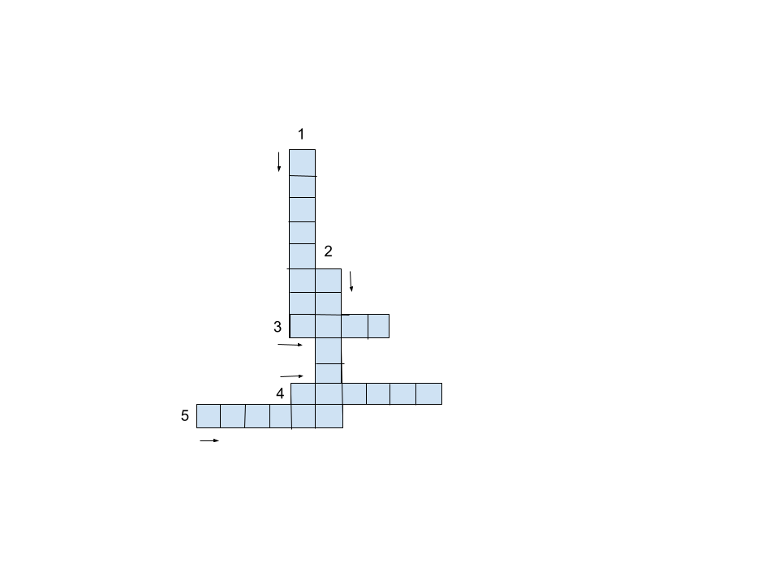

# A liga do pensamento computacional

Esse trabalho visa criar uma nova fazer para o desafio do vestível controlavel.

O desafio completo pode ser visto [aqui](https://www.researchgate.net/publication/369449170_A_Liga_do_Pensamento_Computacional_uma_narrativa_distopica_para_gamificar_uma_disciplina_introdutoria_de_computacao#fullTextFileContent) e [aqui](https://www.researchgate.net/publication/367298685_A_Liga_do_Pensamento_Computacional#fullTextFileContent).

# O Caso do Vestível Controlador - Fase 1,5

## Contexto 
Após o jogador entrar no politecnico, passando da fase 1, ele passa por uma nova fase, anterior a fase 2, a fase 1,5. Essa fase se passa no hall de entrada do Departamento de informática, para receber as dicas da Ressurgência que precisa saber se o jogador é confiavel mesmo, então eles fazem um teste, a fase 1,5.

## Problema
O problema computacional abordado é uma busca no espaço de estados junto a um problema de satisfação de restrições. Há um conjunto de palavras, e dentro desse conjuto há um subconjunto que satisfaz as restrições propostas, e para encontrar esse conjunto, deve ser feito uma busca dentro do cunjunto original.

## Texto
### Fase 1,5. As Palavras definem
Com uma pergunta certeira, você descobriu a entrada correta e se dirigiu a um dos ambientes restritos do Reino do Politécnico: o Departamento de Informática (DInf). Conhecido pela sua tradição em Software Livre, o DInf foi uma das grandes resistências aos ataques que se sucederam ao Caso do Vestível Controlador.

Os membros da Ressurgência tem algumas dicas para te ajudar na próxima fase, mas para isso, eles querem ter certeza de que você é uma pessoa que acredita no avanço da ciência e não apoia pensamentos retrógrados, pois isso vai contra a crença deles.

E para isso, eles montaram um quebra cabeça, jogo muito popular antes do bitcídio, e de alguma forma conseguiram escrever no que antes era o quadro de aviso do Departamento de Informática:

  

*“  Só a pessoa certa pode nos ajudar e só podemos ajudar a pessoa certa, você tem uma chance!*

*Backus, Gudees, Charles, Daamres, George, Teerza, Page, Jari, Dijkstra e Quieroga*

*Embora esses nomes possam parecer estranhos ou incomuns para nós, eles são tão importantes para essas pessoas quanto nossos próprios nomes são para nós. Eles são uma parte fundamental de sua identidade e ajudam a moldar quem são, alguns para o bem, outros para o mal.”*

## Solução trivial
Fazer um busca por força bruta, testando letra a letra, e verificando se bate com uma das palavras do conjunto, e ao encontrar a palavra, verificar se satisfaz as condições necessarias.

## Solução esperta
Verificar os tamanhos das palavras, e separar os conjuntos de palavras que cabem em cada sequencia de espaços.Após isso, fazer uma busca com retocesso, e, a cada conjunto possivelmente valido, testar se ele atende as restrições. 
